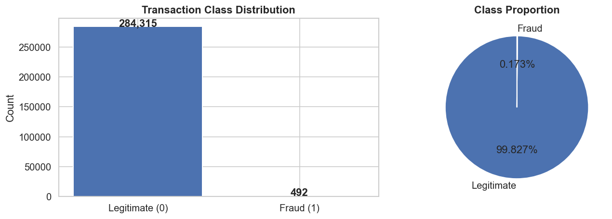
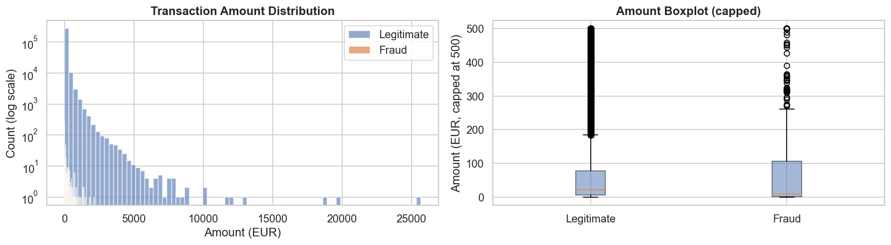
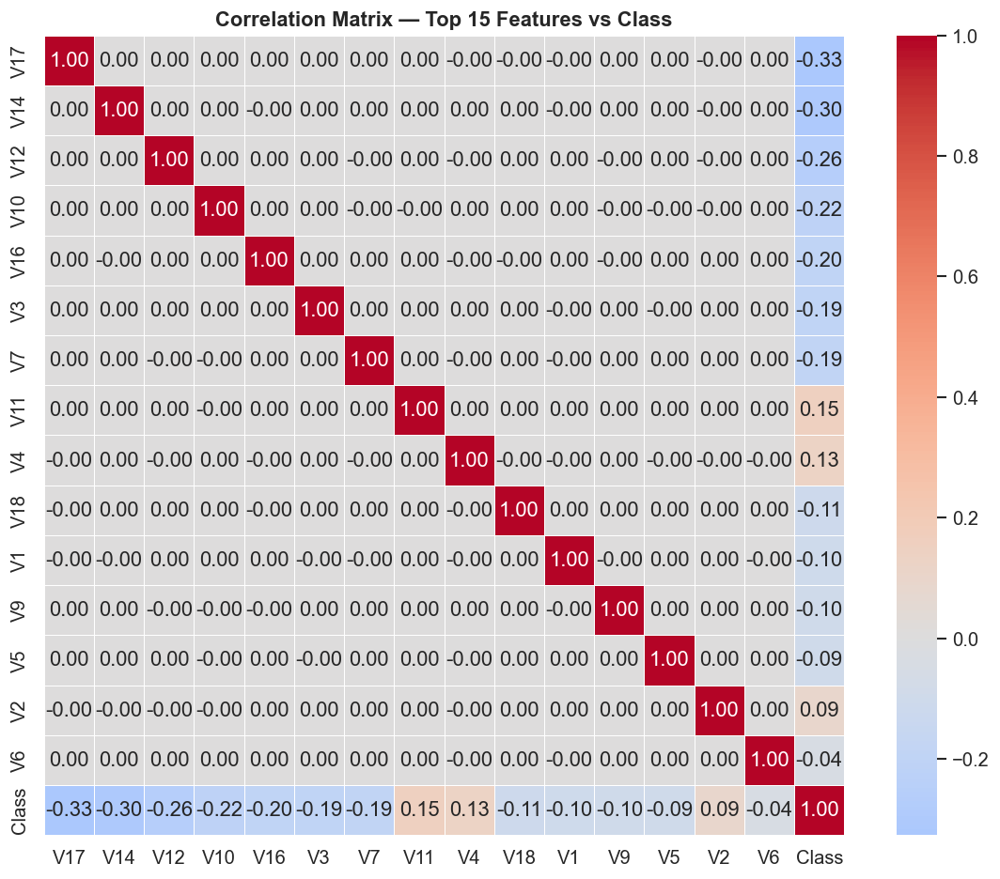
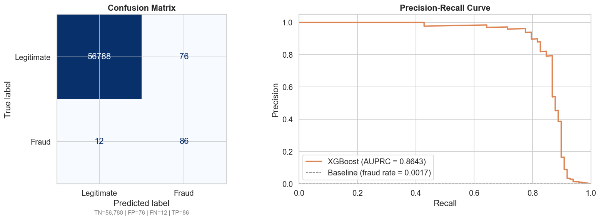
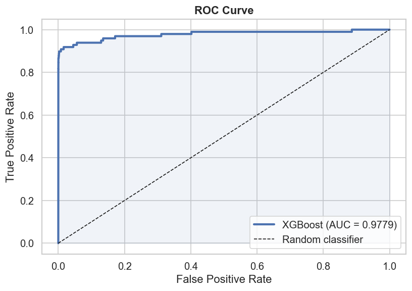
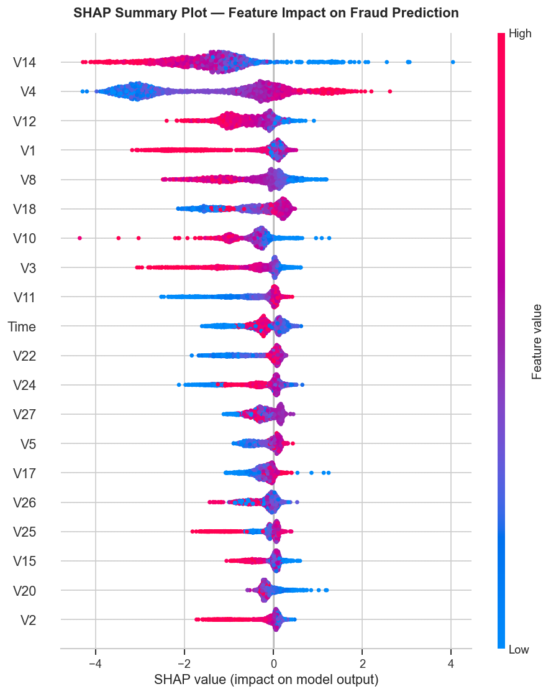
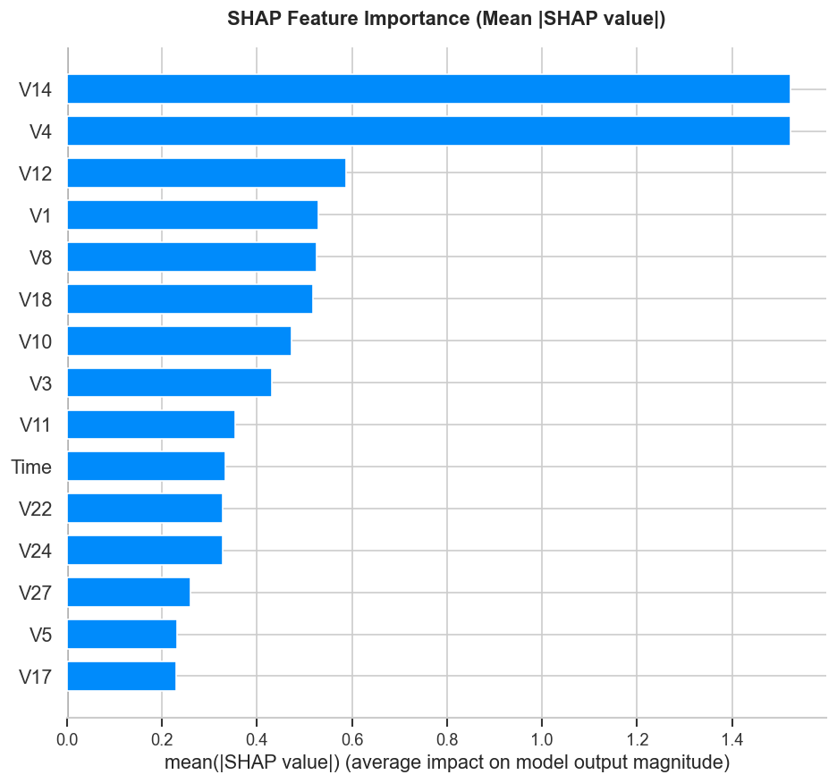
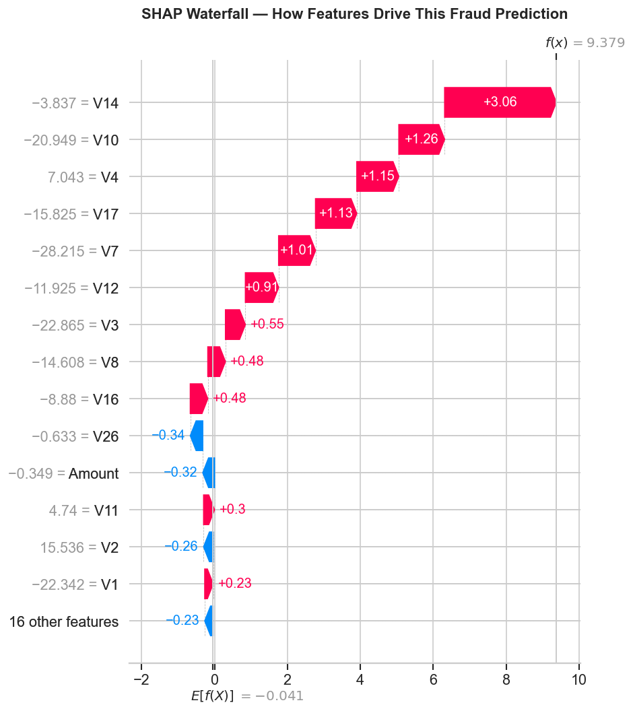
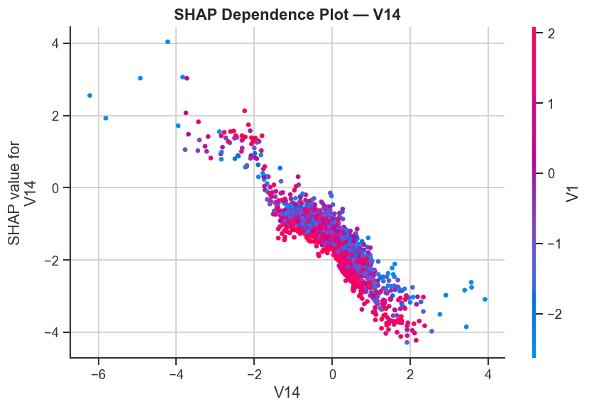

# Credit Card Fraud Detection with Explainable AI (SHAP)

A production-grade machine learning pipeline for detecting fraudulent credit card transactions, with full model explainability using SHAP — directly aligned with UK/EU financial AI regulation requirements (FCA Consumer Duty, EU AI Act).

---

## Key Results

| Metric | Score |
|---|---|
| ROC-AUC | **0.9779** |
| AUPRC (Area Under Precision-Recall Curve) | **0.8643** |
| Recall (Fraud class) | **0.88** |
| Precision (Fraud class) | **0.53** |

> Evaluated on 284,807 real credit card transactions with a severe class imbalance (0.17% fraud rate). AUPRC is the correct primary metric for imbalanced fraud detection — ROC-AUC alone is misleading at this imbalance ratio.

---

## Visualisations

### Class Distribution


### Transaction Amount Distribution


### Correlation Heatmap


### Evaluation Metrics


### ROC Curve


### SHAP Summary Plot (Beeswarm)
Shows which features most strongly drive fraud predictions across the entire test set. Each dot is one transaction, coloured by feature value (red = high, blue = low). **V14 emerges as the dominant predictive signal.**



### SHAP Feature Importance (Bar)
Global ranking of feature contributions — how much each feature moves the model output on average across all predictions.



### SHAP Waterfall Plot
Explains a single high-confidence fraud prediction step by step — showing exactly how each feature pushed the score above or below the baseline. This is the output an analyst would see when reviewing a flagged transaction.



### SHAP Dependence Plot (V14)
Reveals how V14's influence changes across its value range, and which secondary feature it interacts with most.



---

## Why This Matters: XAI in Financial Services

Financial institutions face a dual challenge: **detect fraud accurately** and **explain every decision to regulators and customers.**

A model that flags a transaction as fraudulent but cannot explain why is not deployable in a regulated environment. SHAP solves this by providing:

- **Per-transaction audit trails** — every flag comes with feature-level contributions that can be shown to compliance teams
- **Global model transparency** — summary plots show which signals drive fraud detection across the entire portfolio
- **Data drift detection** — shifts in SHAP value distributions signal when the model is seeing new patterns and needs retraining
- **Regulatory compliance** — directly satisfies explainability requirements under FCA Consumer Duty (2023) and EU AI Act (2024)

---

## Tech Stack

| Component | Tool |
|---|---|
| Language | Python 3.11 |
| ML Framework | XGBoost 2.x |
| Explainability | SHAP 0.44+ |
| Imbalance handling | SMOTE (imbalanced-learn) |
| Data / EDA | pandas, NumPy, seaborn |
| Evaluation | scikit-learn |
| Environment | Jupyter Notebook |

---

## Dataset

**ULB Credit Card Fraud Detection** — Kaggle
https://www.kaggle.com/datasets/mlg-ulb/creditcardfraud

- 284,807 transactions over 2 days (September 2013, European cardholders)
- 492 fraud cases (0.172% of all transactions)
- Features V1–V28: PCA-transformed (anonymised for privacy)
- Features Time, Amount: original values

> The dataset is **not included** in this repository (Kaggle terms of service). Download it separately and place `creditcard.csv` in the `data/` folder before running the notebook.

---

## Project Structure

```
fraud-detection-xai/
├── notebooks/
│   └── fraud_detection_xai.ipynb   # Main analysis notebook
├── data/
│   └── .gitkeep                    # Place creditcard.csv here
├── outputs/
│   ├── plots/                      # All generated visualisations
│   └── models/                     # Saved model artefacts
├── requirements.txt
├── SETUP_GUIDE.md
├── .gitignore
└── README.md
```

---

## Quick Start

```bash
# 1. Clone the repository
git clone https://github.com/ac220902/fraud-detection-xai.git
cd fraud-detection-xai

# 2. Create and activate a virtual environment
python -m venv venv
source venv/bin/activate        # Windows: venv\Scripts\activate

# 3. Install dependencies
pip install -r requirements.txt

# 4. Download the dataset from Kaggle and place it in data/
#    https://www.kaggle.com/datasets/mlg-ulb/creditcardfraud
#    Place creditcard.csv in the data/ folder

# 5. Launch Jupyter and open the notebook
jupyter notebook notebooks/fraud_detection_xai.ipynb
```

Run all cells top to bottom. Outputs are saved to `outputs/plots/` and `outputs/models/`.

---

## Connection to Dissertation Work

This project applies the same SHAP-based explainability framework developed in my MEng dissertation (*SHAP-based Explainable AI Framework for Software Defect Prediction*, University of Leicester, 2026 — awarded 83.97%) to a real-world, highly imbalanced binary classification problem.

The dissertation explored SHAP's properties in a software engineering context (interpretability scoring, accuracy-interpretability tradeoff). This project demonstrates those same properties in a production-scale financial use case — the exact setting where model transparency is most critical and least often implemented.

---

## Author

**Aditi Chauhan**
MEng Engineering Management (Distinction) | University of Leicester
XAI Researcher | Former Oracle Financial Services & Infosys

[LinkedIn](https://www.linkedin.com/in/adi22) · [GitHub](https://github.com/ac220902)

---

*Dataset credit: Machine Learning Group, Université Libre de Bruxelles (ULB)*
